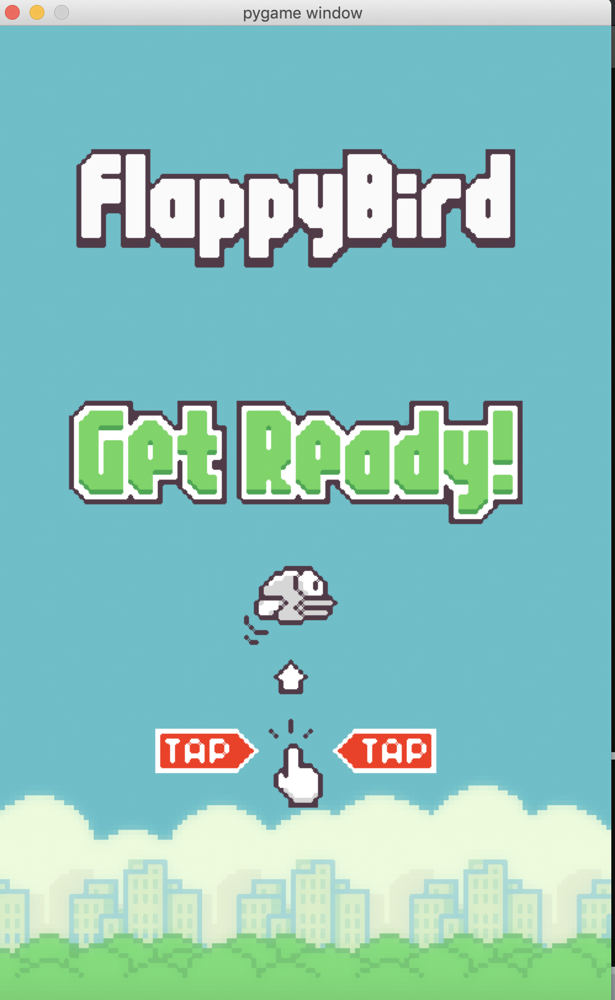
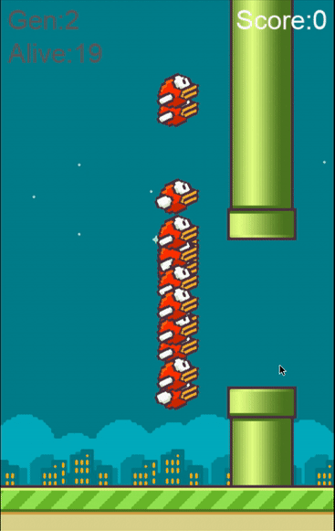

# AI_Flappy_Bird
---
This repository holds the **Flappy Bird** game implementations where you
can play the game manually or train an AI to play the game.

## Contents

- Flappy Bird game:

   
Start game
  
   

- AI Flappy Bird with NEAT algorithm:
   
Start game
  
   

## Usage

* To play the game manually:
 *  Run `python bird_manual.py`
 *  Click or press <kbd>Space</kbd> to start the game.
 *  Press <kbd>Space</kbd>or<kbd>UP</kbd> to control the bird.
 *  Press <kbd>Escape</kbd> to exit the game.

* To train an AI to play the game:
 * Run `python bird_ai.py` 
    
## Dependencies
- pygame
- numpy
- neat-python
- os
- sys
- random

## Acknowledgements

The Flappy Bird game design images come from Github repository [FlapPyBird](https://github.com/sourabhv/FlapPyBird) and some code of the NEAT algorithm implementation on Flappy Bird game comes from [NEAT-Flappy-Bird](https://github.com/techwithtim/NEAT-Flappy-Bird).

You can also check [NEAT-Python](https://neat-python.readthedocs.io/en/latest/) to find the official documentation of Neat-Python.

